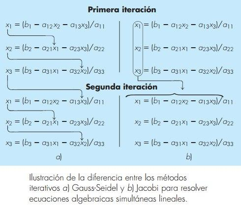

# Método de Gauss-Seidel

Conforme un nuevo valor de $x$ se calcula, este se usa inmediatamente en la siguiente ecuación para determinar el otro valor de $x$. De esta forma, si la solución es convergente, se empleara la mejor aproximación disponible.

## Ejemplo

$$
15c_1-3c_2-c_3=3300 \quad,\quad c_1=(3300+3c_2+c_3)/15 \\
-3c_1+18c_2-6_3=1200 \quad,\quad c_2=(1200+3c_1+6c_3)/18 \\
-4c_1-c_2+12_3=2400 \quad,\quad c_2=(2400+4c_1+c_2)/12 \\
$$

| $i$  | $c_1$      | $c_2$      | $c_3$      | $E_ac_1$ |
| ---- | ---------- | ---------- | ---------- | -------- |
| 0    | 0          | 0          | 0          | -        |
| 1    | 220        | 103.33333  | 281.944444 | 100      |
| 2    | 259.462963 | 203.891975 | 303.478652 | 15.21    |
| 3    | 281.010305 | 214.661268 | 311.558541 | 7.83     |
| 4    | 283.702823 | 217.803318 | 312.717884 | 0.95     |
| 5    | 284.408523 | 218.307382 | 312.995123 | 0.25     |

